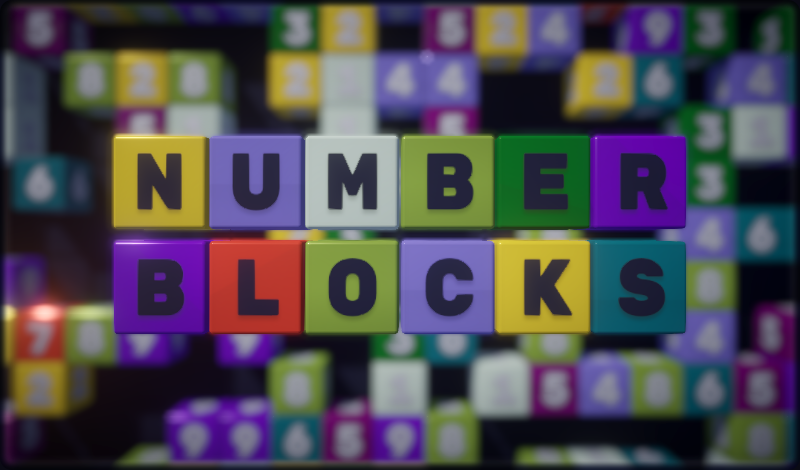
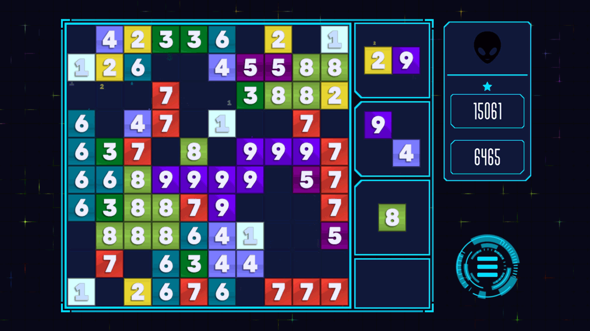

 

> Number Blocks is a game that combines Wood Blocks and match-three mechanics. The difficulty level can be adjusted to suit everyone, so everyone can find their own comfortable game mode.
>> The goal of the game is to arrange blocks of numbers into clusters according to their value. The cluster contains blocks that are adjacent in a straight line (top, left, bottom, right). To remove a cluster of 2s, you only need two blocks, a cluster of 3s - three blocks, and so on up to 9s - there must be at least nine of them.
When a cluster is removed, all adjacent 1s and their clusters are destroyed.
You have Zero-Bombs at your disposal. When the Zero-Bombs is placed on the board, it will explode and destroy blocks (without scoring any points) within a one-cell radius.
When a block is placed on the board, it scores points equal to its value. The points for removing a block are twice the value of the block. Each block removed that exceeds the required minimum in the cluster gives double points (value multiplied by four). 1s score points based on the value of the cluster they join (no bonus points for exceeding the minimum).

 

 

 

